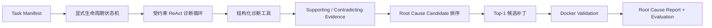

# CodeRCA

CodeRCA 是一个面向单仓库 CI 测试失败的根因分析 Agent 原型。它围绕 **Hypothesis → Evidence → Experiment** 循环，自主检查代码变更、检索相关实现、运行诊断实验，并在隔离环境中验证 Top-1 候选补丁。

项目用于展示 AI Agent 开发中的工作流编排、工具系统、上下文工程、代码 RAG、受控执行和工程 Evaluation，而不是构建生产级故障平台或研究级 Benchmark。

## 核心闭环



Agent 初始形成最多三个可证伪 Hypothesis。每次工具调用必须关联一个活跃 Hypothesis、调用目的和预期 Observation；程序负责 Schema、状态转移、权限、超时、Evidence Score、工具预算和停止条件。

## 技术亮点

- **Agent 工作流**：最小显式状态机控制生命周期，在诊断循环内部使用受约束 ReAct；
- **Tool Runtime**：统一 Tool Spec 管理输入输出 Schema、权限、超时、错误和审计，MVP 固定五个诊断工具；
- **Context Engineering**：每一步从结构化 Agent 状态重新组装有界上下文，不无限追加完整历史；
- **代码 RAG**：Python AST 语义分块，结合 BM25、向量召回、固定融合和 CPU reranker；
- **实验与评测**：在最小 Docker 执行边界中运行测试和补丁，通过 Outcome Evaluation 与 Trajectory Evaluation 检查结果和 Agent 行为。

## MVP 范围

第一版正式支持：

- 一个冻结的开源 Django 仓库；
- 由已知代码变更导致的业务逻辑回归；
- 同仓库、同镜像和注册命令集合下的新 Diagnosis Task；
- 三个分别强调 diff/代码、RAG 和测试 Experiment 的冻结任务；
- 一个固定的 Gemini 云端模型 API、本机 CLI 和串行 Diagnosis Run。

以下能力延期：API 契约变化、配置错误、任意仓库兼容、完整检索消融、Baseline、LLM Judge、大规模隐藏集、FastAPI、Web UI、SQLite、本地模型与多模型适配、MCP 和生产级沙箱。

三个冻结任务只用于证明原型闭环和工程回归，不用于声称统计显著性或跨仓库泛化能力。

## 项目状态

项目已完成 MVP Scope Reduction、领域建模、架构设计和 implementation-ready specification。当前提供 CRCA-001 的 Manifest-to-Run walking skeleton；完整诊断状态机和后续工具仍在规划中。

- [Implementation specification issue](https://github.com/N1rv2na/CodeRCA-agent/issues/1)
- 目标交付方式：源码安装 + Gemini Developer API + 固定 Docker 镜像 + CLI

## CRCA-001 本地运行

使用 Python 3.10 或更高版本创建环境并安装开发依赖：

```bash
python -m venv .venv
.venv/bin/python -m pip install -e '.[dev]'
```

提交符合 Task Manifest Schema 的 JSON 文件后运行：

```bash
.venv/bin/coderca MANIFEST.json --runs-dir .coderca-runs
```

命令会输出结构化终态摘要。每个 Diagnosis Run 目录包含 `manifest.json`、`events.jsonl` 和 `report.json`。当前使用确定性的 `FakeModelProvider`，不会调用 Gemini API，也不会执行仓库工具或补丁验证。

## 文档

- [两周 MVP 设计](docs/design.md)
- [MVP Specification](docs/spec.md)
- [统一语言](CONTEXT.md)
- [架构决策记录](docs/adr/README.md)
- [文档索引](docs/README.md)
