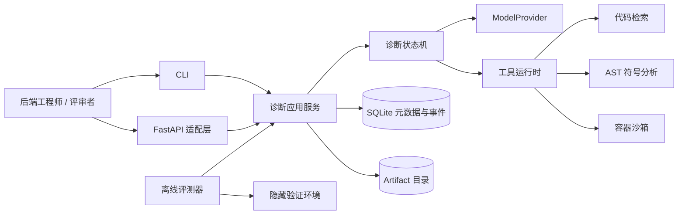
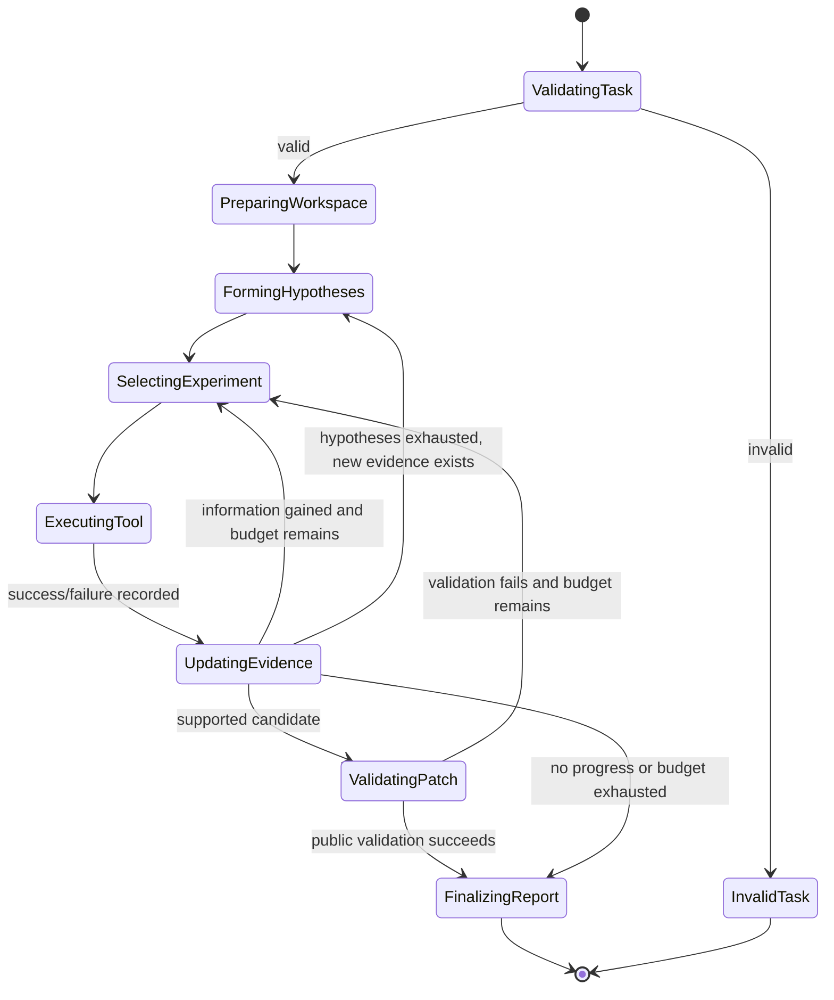

# CodeRCA 设计文档

| 属性 | 内容 |
|---|---|
| 状态 | Draft / 已完成需求澄清，待实现验证 |
| 日期 | 2026-08-05 |
| 目标版本 | MVP，计划于 2026-08-20 前完成 |
| 主要读者 | 项目作者、评审者、AI Agent 岗位面试官 |

## 1. 摘要

CodeRCA 是一个面向 Python/Django 单仓库 CI 测试失败的根因分析 Agent。它接收故障仓库快照、CI 日志、故障变更和受控测试入口，自主维护候选根因假设，调用代码检索与诊断工具收集证据，在隔离沙箱中通过实验和候选补丁验证假设，最终输出可追溯的 Top-1/Top-3 根因分析报告。

项目首先是 AI Agent 开发岗位的求职作品。MVP 不追求生产级事故平台的广度，而是用可复现的运行轨迹、对照基线和冻结评测集，证明以下能力：

1. 显式 Agent 工作流与状态管理；
2. 结构化工具协议与安全执行边界；
3. 代码 RAG、混合检索和 reranking；
4. 沙箱实验与补丁验证；
5. 可重复、可审计的 Agent 评测。

## 2. 产品定位

### 2.1 第一目标

在 5–10 分钟的演示和后续技术追问中，让评审者能够验证 CodeRCA 的设计不是单次 LLM 调用、固定工具流水线或人工准备的成功案例。

### 2.2 目标用户

第一版只服务在单个 Python/Django 仓库中处理 CI 测试失败的后端工程师。目标任务是：

> 当一个已知代码变更导致 CI 测试失败时，定位缺陷位置，解释从触发条件到失败表现的因果链，给出排序后的候选根因和修复建议，并在隔离环境中验证最可信候选。

### 2.3 支持范围

- 业务逻辑回归；
- API 契约变化；
- 配置错误。

### 2.4 明确不支持

- 外部服务故障；
- 性能和容量问题；
- 随机、flaky 或并发问题；
- 生产环境 Trace、Metrics 与告警查询；
- 跨仓库或跨语言泛化保证；
- 自动提交 PR 或修改真实仓库；
- 公网、多用户或生产级托管服务；
- 恶意代码下的强隔离与容器逃逸防护。

## 3. 成功标准

### 3.1 产品完成条件

一次诊断完成后，用户获得：

- 根因文件、符号与行区间；
- 根因机制解释；
- 可追溯的支持证据与反对证据；
- Top-1/Top-3 候选排序；
- 修复建议；
- 候选补丁及其公开测试验证状态；
- 未知项、失败实验和剩余风险。

不得把“测试通过”等同于“因果解释正确”。位置、因果解释和补丁验证分别评分。

### 3.2 MVP 评测门槛

在 12 个隐藏任务上：

- 根因位置 Top-1 命中率不低于 50%；
- 根因位置 Top-3 命中率不低于 75%；
- 结构化因果字段平均正确率不低于 70%；
- Top-1 相比最佳基线至少多命中 2 个任务；
- 至少 50% 的任务生成通过完整隐藏验证的补丁；
- 三次重复运行中，至少 10/12 个任务保持相同的规范化 Top-1 根因符号；
- Agent 的中位 Token 成本不超过固定流水线的 3 倍。

所有汇总指标必须同时提供逐任务结果、失败案例、运行耗时和模型用量。

## 4. 核心设计原则

1. **假设驱动**：每次工具调用必须服务于一个活跃假设。
2. **证据优先**：结论必须引用日志、代码、变更或实验结果，不以模型自信替代证据。
3. **显式状态**：模型提出决策，程序校验状态转移、预算、权限与终止条件。
4. **实验可证伪**：失败实验只有在确实构成反证时才能淘汰假设。
5. **检索与 Agent 分离评测**：先验证检索器，再验证动态工作流。
6. **隐藏测试单向隔离**：最终隐藏结果不能反馈给 Agent。
7. **失败可见**：模型、工具、基础设施和任务数据失败分别统计，不能静默剔除。
8. **声明不超过证据**：MVP 只声明单仓库、指定故障类型和有限沙箱威胁模型。

## 5. 系统上下文与边界上下文



| 边界上下文 | 职责 | 不负责 |
|---|---|---|
| Task Intake | 校验任务契约，准备仓库和环境 | 诊断推理 |
| Diagnosis | 管理假设、证据、实验、预算和状态转移 | 直接执行不受控命令 |
| Retrieval | 建立代码索引并返回排序结果 | 判断最终根因 |
| Tool Runtime | Schema 校验、权限、超时、错误和审计 | 业务推理 |
| Sandbox | 创建隔离实验工作区并运行白名单操作 | 抵御生产级恶意攻击 |
| Reporting | 生成 RCA 报告和可回放事件轨迹 | 隐藏集评分 |
| Evaluation | 冻结任务、运行基线、评分与汇总 | 向 Agent 泄漏隐藏反馈 |

边界上下文通过显式 DTO 和 artifact 引用通信，不共享框架对象。FastAPI 请求对象不得进入领域层。

## 6. 领域模型

完整术语定义见 [CONTEXT.md](../CONTEXT.md)。

### 6.1 聚合与实体

#### DiagnosisTask 聚合

`DiagnosisTask` 是一次诊断的事务边界，包含：

- 不可变的任务输入和版本标识；
- 当前 `DiagnosisRun`；
- 最多三个活跃 `Hypothesis`；
- `Evidence` 与 `Experiment` 引用；
- 预算、停止原因和最终报告引用。

关键不变量：

- 活跃假设不超过 3 个；
- 工具调用必须关联一个假设和预期信息增益；
- 被拒绝的假设不能直接恢复为已支持，必须产生新证据并重新进入候选状态；
- 最终补丁封存后不得接收隐藏测试反馈；
- 超出预算后不能继续调用工具。

#### Hypothesis

一个可被证据支持或被实验证伪的根因陈述，状态限定为：

```text
proposed → testing → supported
                   ↘ rejected
                   ↘ inconclusive
```

每个假设包含缺陷位置、机制、支持证据、反对证据、验证状态和排序分数。分数用于排序，不宣称为统计概率。

#### Evidence

证据必须有来源、artifact 引用、代码/日志定位、支持或反对方向及强度。证据强度遵循：

```text
可复现实验结果 > 直接堆栈或代码证据 > Git 关联 > 语义相似性
```

使用简单整数权重，并只允许在验证集进行一次有限校准。

#### Experiment

实验描述要验证的假设、预期观察、使用工具、实际观察和结论。一次失败只有在预期观察足以证伪时，才能将假设标记为 `rejected`。

### 6.2 运行状态机



### 6.3 停止条件

满足任一条件即停止：

- 候选补丁通过 Agent 可见的完整验证；
- 达到最多 15 次工具调用；
- 达到任务时间、Token 或成本预算；
- 连续 3 步没有新增或推翻关键证据；
- 所有候选均被拒绝且没有足够证据生成新候选。

停止时允许输出“证据不足”，不得为了格式要求强行编造 Top-1。

## 7. 输入与输出契约

### 7.1 DiagnosisTaskInput

第一版必填：

- `repository_path` 或 `benchmark_task_id`；
- `base_commit` 与 `faulty_commit`；
- CI 日志 artifact；
- 预先注册的测试命令 ID；
- 容器镜像摘要；
- 允许修改的源码路径；
- 单任务时间、Token 和工具调用预算。

Git diff 由系统根据两个 commit 生成。环境不可复现或字段非法时，任务标记为 `invalid_task`，不计为 RCA 推理失败。

### 7.2 RootCauseReport

报告至少包含：

- 任务、代码和环境版本；
- Top-1/Top-3 `RootCauseCandidate`；
- 根因位置和机制；
- 支持与反对证据引用；
- 已执行实验及其结果；
- 修复建议、候选补丁和公开验证状态；
- 停止原因、未知项和风险；
- 运行成本与事件轨迹引用。

## 8. Agent 工作流与上下文工程

### 8.1 单 Agent 运行时

MVP 使用一个诊断 Agent 加工具，不引入运行时多 Agent。开发过程中使用编码子 Agent 不属于产品架构，也不作为项目能力声明。

状态机由项目自行实现，不依赖框架默认 ReAct 循环。模型负责：

- 提议和修订根因假设；
- 选择下一实验；
- 说明结构化的调用目标和预期观察；
- 根据新证据更新候选；
- 生成修复建议和候选补丁。

程序负责：

- Schema 和状态转移校验；
- 权限、预算和超时；
- 工具执行与错误分类；
- 证据引用和 artifact 管理；
- 停止策略和事件持久化。

### 8.2 上下文组成

常驻上下文只包含：

- 任务目标与约束；
- 最多三个活跃假设；
- 证据表和实验摘要；
- 当前预算与最近动作；
- 必要的代码、日志原文引用。

完整日志、代码、模型原始输出和测试输出保存在 artifact store。低价值结果被压缩或移出上下文，需要时按引用重新读取。系统不把完整历史无限追加到 prompt。

### 8.3 结构化输出恢复

模型输出先按 JSON Schema 校验。校验失败时保存原始输出和错误，并允许模型自修复一次；再次失败则记录 `schema_failure` 并终止当前步骤。禁止用模糊正则静默猜测模型原意。

## 9. 工具运行时

工具运行时达到“精简 C”边界，不实现 MCP。每个 `ToolSpec` 包含：

- 名称、描述和版本；
- JSON Schema 输入输出；
- 权限类别：只读、代码执行或文件修改；
- 独立超时；
- 结果大小限制和 artifact 策略；
- 错误语义；
- 是否有副作用。

统一错误分类：

- `invalid_arguments`；
- `permission_denied`；
- `timeout`；
- `execution_failed`。

第一版不自动重试工具，避免重复副作用。运行记录至少包含关联假设、调用原因、预期结果、耗时、状态和结果摘要。

### 9.1 冻结工具集

| 工具 | 职责 | 关键限制 |
|---|---|---|
| `search_code` | 统一代码检索 | Agent 不感知具体消融配置 |
| `read_code` | 按文件和行号读取 | 路径必须位于任务仓库 |
| `inspect_symbol` | AST 定义、引用、导入和近似调用边 | 不声明完整 Python 调用图 |
| `inspect_diff` | 查看故障变更 | 不暴露修复 diff 或未来 commit |
| `run_tests` | 执行注册测试命令 | 禁止任意 Shell |
| `apply_patch` | 修改实验工作区 | 仅允许白名单源码路径 |
| `static_check` | 语法、格式和静态约束 | 不能替代隐藏测试 |

## 10. 代码 RAG

### 10.1 索引

只索引故障版本仓库快照，不索引修复后代码、答案性 commit message 或未来历史。

以 Python AST 的函数、方法和类作为主要语义块，记录文件路径、符号名、父类和行区间；超长语义块再按 Token 窗口拆分并保留重叠上下文。

`inspect_symbol` 只提供启发式静态关系。动态导入、运行时分派等不可解析关系保留为未知，不声称调用图完整。

### 10.2 查询

查询同时使用：

- 从 CI 日志确定性提取的异常类型、消息、堆栈、失败测试和文件符号；
- Agent 根据当前假设生成的语义查询。

每条动态查询必须关联一个假设。完整 CI 日志不能直接作为唯一查询。

### 10.3 检索管线

产品运行时仅暴露统一的 `search_code`。底层支持四种冻结实验配置：

1. BM25；
2. 向量检索；
3. BM25 + 向量混合检索；
4. 混合检索 + reranker。

离线消融对所有配置使用相同的冻结标准查询。核心 `Recall@K` 和 `MRR` 只按标注的根因符号计算；直接上下游代码作为辅助证据覆盖率，不替代根因命中。

## 11. 模型策略

CodeRCA 通过最小 `ModelProvider` 接口调用独立 HTTP 推理服务，Agent 进程不直接加载模型。

- 本地开发：优先使用可在 RTX 4060 Ti 8 GB 上稳定运行的量化代码模型；
- embedding 与 reranker：优先本地运行；
- 云端兜底：若本地模型无法通过早期质量门槛，最终端到端评测允许使用云端诊断模型；
- LLM Judge：与诊断模型使用不同模型家族，匿名评分并人工复核全部隐藏任务。

本地模型进入完整评测前必须满足：

- 适配显存和速度约束；
- JSON Schema 和工具参数成功率不低于 90%；
- 3 个代表任务中至少 2 个命中 Top-3；
- 能稳定生成可应用补丁；
- 三次运行不出现完全不同的无证据结论。

本地单任务最多运行 15 分钟。面试实时演示选择能在 5 分钟内完成的任务；复杂案例通过明确标识的真实轨迹回放展示。

## 12. 沙箱与补丁验证

### 12.1 威胁模型

沙箱用于防止正常测试代码意外影响宿主机，并隔离不受信任但非刻意恶意的开源仓库。它不承诺抵御容器逃逸、内核漏洞或生产多租户攻击。

最低控制：

- 每个基准仓库使用预构建且依赖锁定的镜像；
- 运行时关闭网络；
- 使用非 root 用户和临时工作区；
- 限制 CPU、内存和执行时间；
- 不挂载宿主凭证；
- 基础镜像只读；
- 只允许预注册命令。

### 12.2 实验权限

Agent 可以运行测试、添加临时插桩、创建探索性测试和临时修改业务代码。禁止修改或删除已有测试、访问隐藏测试、执行任意 Shell 或修改任务基础设施。

实验改动与最终候选补丁分别记录。Top-3 候选按排序逐个验证；某个候选通过公开验证后提升为 Top-1，并停止生成其他正式补丁。

### 12.3 隐藏验证

Agent 完成并封存补丁后，独立评测器运行：

- 原失败测试；
- 邻近行为测试；
- 防投机测试；
- 静态补丁约束。

隐藏结果只用于评分，不反馈给 Agent。静态约束拒绝修改/删除/跳过测试、宽泛异常静默、删除公共 API、硬编码测试输入，以及修改评测器、依赖锁或容器配置等行为。

## 13. 持久化、服务与演示

### 13.1 持久化

SQLite 保存任务、运行、状态和结构化事件。日志、补丁、代码快照、测试输出和模型原始响应等大对象存入本地 artifact 目录，并按内容哈希引用。

事件采用追加式记录，主要类型包括：

- `hypothesis_created`；
- `evidence_added`；
- `experiment_started`；
- `tool_finished`；
- `hypothesis_rejected`；
- `patch_validated`；
- `run_stopped`。

事件记录结构化决策摘要，不依赖暴露模型私有思维链。

### 13.2 FastAPI 与 CLI

Agent 核心是普通 Python 包。FastAPI 只负责提交任务、查询状态和获取报告；CLI 与 API 调用同一应用服务层。

MVP 为本地单用户服务，只绑定 `127.0.0.1`，不接受任意代码上传。单个后台 worker 串行执行任务；服务重启后未完成任务标记为 `interrupted`，不承诺自动恢复。

### 13.3 演示

演示入口是 CLI 实时任务加静态可视化报告：

1. 运行一个冻结任务；
2. 展示结构化的假设、证据和实验事件；
3. 查看最终 RCA 和验证结果；
4. 展示预生成的检索消融、基线对比和失败案例；
5. 网络或模型不可用时回放真实运行，并明确标记为回放。

## 14. 数据集设计

### 14.1 规模与划分

目标为 30 个任务：

- 12 个开发任务；
- 6 个验证任务；
- 12 个隐藏任务；
- 三类支持故障原则上各 10 个；
- 计划包含 24 个可控注入任务和 6 个真实修复任务。

第一版只声称对同一仓库中的未见故障具有泛化能力。真实 commit 用于探索性外部有效性，不能据此宣称跨仓库泛化。

### 14.2 仓库选择

选择一个中等规模、测试完善且可稳定构建的真实 Django 项目。它必须包含相似符号、跨模块调用和足够检索干扰，同时测试仍能在受控时间内完成。

### 14.3 数据泄漏控制

- 在 Agent 工作流调优前冻结任务格式和数据划分；
- 隐藏任务不参与 prompt、检索或状态机调试；
- 移除修复 diff、答案性 commit message 和未来代码；
- 至少一半任务具有多个合理候选改动，不能只看单行 diff 得出答案；
- 故障需要结合日志、依赖关系或实验判断，不机械添加无意义噪声；
- 检索索引严格绑定故障 commit。

### 14.4 标准答案

每个任务至少标注：

- `trigger`；
- `defect_location`；
- `fault_mechanism`；
- `propagation`；
- `failure_observation`；
- `required_fix_behavior`；
- 参考补丁与隐藏验证。

## 15. 评测设计

### 15.1 两阶段评测

#### 检索层

四种检索配置在冻结任务上使用相同查询，报告 `Recall@K`、`MRR`、根因符号命中和辅助证据覆盖。检索层不运行完整 Agent。

#### 端到端层

在验证集选择一种检索配置后，在隐藏集比较：

1. CI 日志 + Git diff 的单次模型调用；
2. 固定工具流水线；
3. 动态 CodeRCA Agent。

固定流水线提前冻结：解析日志、读取 diff、执行一次检索、读取固定数量代码、运行一次失败测试、单次生成报告与补丁、在相同沙箱验证。它不能追加查询或根据中间结果改变路径。

三种方案使用相同诊断模型、故障输入、检索配置和验证环境。动态 Agent 的成本优势或劣势必须单独报告。

### 15.2 因果评分

`defect_location` 使用确定性匹配。其他字段由独立 LLM Judge 按以下刻度评分：

- 0：错误；
- 1：部分正确；
- 2：完整正确。

Judge 必须给出简短理由和标准答案依据，并且看不到系统名称、检索配置和运行轨迹。作者人工复核全部 12 个隐藏任务，记录同意、修正或无法判断，并报告一致率。

### 15.3 稳定性与复现

最终 Agent 在 12 个隐藏任务上重复运行 3 次。每次运行生成不可变 `run_manifest`，固定或记录：

- 模型与量化版本；
- 推理参数和随机种子；
- prompt 和检索索引版本；
- 仓库与容器镜像摘要；
- 工具预算和超时；
- 任务顺序；
- 仍无法消除的非确定性。

### 15.4 失败分类

结果至少区分：

- `invalid_task`；
- `infrastructure_failure`；
- `model_failure`；
- `agent_decision_failure`；
- `diagnosis_incorrect`；
- `success`。

所有类别均报告原始数量和分母。只有明确无副作用的瞬时基础设施错误允许一次重试。

## 16. 测试策略

1. **单元测试**：状态转移、证据计分、预算和停止条件；
2. **工具契约测试**：Schema、权限、超时、错误分类和结果截断；
3. **集成测试**：索引、SQLite、artifact、容器和模型适配器；
4. **端到端评测**：30 个冻结 RCA 任务与基线。

状态机和工具测试使用可编程 `FakeModelProvider`；集成测试可使用录制响应；只有显式标记的 `live_model` 测试调用真实模型。CI 默认不运行昂贵的 live-model 测试。

仓库最低质量门槛：统一 `pyproject.toml`、格式与 lint、核心公共接口类型检查、一条命令运行非模型测试、可重复初始化存储、实验配置与随机种子版本化，以及核心代码不依赖绝对路径或秘密凭证。

## 17. 交付约束与降级策略

总投入约 80 小时。2026-08-10 前必须用一个任务跑通最简纵向闭环：

```text
任务输入 → 假设 → 工具 → 检索 → 补丁 → 沙箱测试 → 报告 → 事件轨迹
```

若 2026-08-12 进度落后，按以下顺序降级：

1. 移除 FastAPI，只保留 CLI；
2. 移除可视化美化，只保留静态 HTML/JSON；
3. 减少真实 commit 数量，但保持 30 个总任务；
4. 不削减 Agent 工作流、工具运行时、RAG 消融、沙箱和评测；
5. 不降低隐藏集隔离与标注质量。

## 18. 风险与缓解

| 风险 | 后果 | 缓解 |
|---|---|---|
| 8 GB 显存限制本地模型 | 推理慢、工具调用不稳 | 2026-08-08 前做代表任务门槛测试；允许云端兜底 |
| 30 个任务制作成本过高 | 实现与评测延期 | 模板化注入、复用镜像和 fixture；先冻结数据格式 |
| Git diff 使任务过于简单 | RAG/Agent 增益不可信 | 多个合理候选改动和跨模块因果任务 |
| LLM Judge 偏差 | 因果指标不可信 | 异模型、匿名评分、结构化 rubric、全量人工复核 |
| 测试通过但根因错误 | 补丁指标误导 | 位置、因果和补丁三套独立指标 |
| Agent 成本过高 | 相比流水线缺乏价值 | 工具/Token 预算和 3 倍中位成本上限 |
| 沙箱安全被过度宣传 | 技术声明站不住 | 明确有限威胁模型，默认禁网、限权、无凭证 |

## 19. 尚未冻结的决策

以下事实应通过早期实验决定，而不是现在凭偏好锁死：

- 具体 Django 基准仓库；
- 本地诊断模型、量化格式与推理服务；
- 云端兜底模型与独立 Judge；
- embedding 模型、向量索引实现和 reranker；
- BM25/向量融合方法及 Top-K；
- 云端 API 的实际预算上限；
- 模型凭证脱敏与宿主/容器隔离的最终实现测试。

## 20. 架构决策记录

- [ADR-0001：使用自研显式诊断状态机](adr/0001-explicit-diagnosis-state-machine.md)
- [ADR-0002：采用统一结构化工具运行时且不实现 MCP](adr/0002-typed-tool-runtime.md)
- [ADR-0003：统一检索接口并隔离检索消融](adr/0003-retrieval-ablation-boundary.md)
- [ADR-0004：采用有限威胁模型的容器沙箱](adr/0004-container-sandbox-boundary.md)
- [ADR-0005：SQLite 元数据与内容寻址 Artifact 分离](adr/0005-persistence-and-artifacts.md)
- [ADR-0006：本地优先、云端兜底的模型策略](adr/0006-model-provider-strategy.md)
