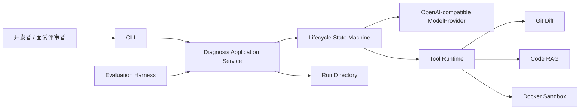
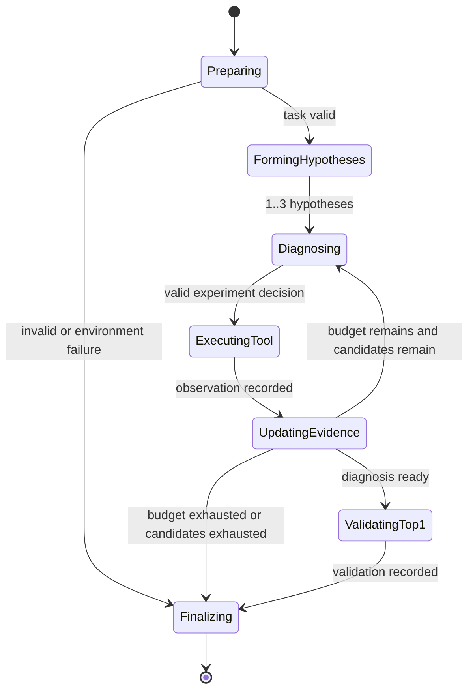

# CodeRCA 两周 MVP 设计文档

| 属性 | 内容 |
|---|---|
| 状态 | Accepted |
| 决策日期 | 2026-08-06 |
| 交付目标 | 单人两周内完成可真实运行的 Agent 求职原型 |
| 主要招聘信号 | Agent 工作流与 Tool Runtime |
| 支持范围 | 一个冻结 Django 仓库中的业务逻辑回归 |
| 权威术语 | [CodeRCA Context](../CONTEXT.md) |

## 1. 摘要

CodeRCA 是一个诊断单仓库 CI 测试失败的 AI Agent 原型。用户提交一个指向 Faulty Commit、CI 日志和注册测试命令的 Diagnosis Task，Agent 通过显式的 Hypothesis–Evidence–Experiment 循环检查变更、检索代码、读取实现、运行测试并验证一个 Top-1 候选补丁，最终生成可追溯的 Root Cause Report。

MVP 的目标不是证明 CodeRCA 在大规模数据集上优于其他系统，也不是交付通用故障平台。它要用一条真实、可检查的纵向闭环证明：模型决策可以被程序约束，工具调用可以服务于可证伪 Hypothesis，Evidence 可以改变候选排序，最终判断可以通过受控 Experiment 和 Validation 获得支持。

## 2. 产品定位与成功定义

### 2.1 第一目标

本项目首先是 AI Agent 开发岗位的求职作品。面试官应能通过源码、自动化测试和真实 Diagnosis Run 产物验证以下能力：

1. 最小显式状态机与受约束 ReAct 的组合；
2. 结构化 Tool Spec、权限、超时、错误与审计；
3. 有界上下文和结构化 Agent 状态；
4. Agent 可调用的代码 RAG；
5. Docker 中的真实 Experiment 与 Top-1 补丁 Validation；
6. 面向结果和轨迹的工程回归 Evaluation。

### 2.2 MVP 完成条件

MVP 完成必须同时满足：

- 一个通过 Model Compatibility Gate 检查的已配置 OpenAI-compatible 云端模型能够完成至少一个真实端到端 Diagnosis Run；
- 五个工具均通过统一契约测试；
- Agent 能维护最多三个 Hypothesis，并用 Supporting Evidence 和 Contradicting Evidence 更新排序；
- Agent 能为 Top-1 生成一个可应用补丁，并在 Docker 中运行注册 Validation；
- 运行过程保存结构化事件和 Root Cause Report；
- 三个冻结任务可以执行确定性的 Outcome Evaluation 与 Trajectory Evaluation；
- 默认自动化测试不依赖真实模型 API、API Key 或网络。

三个任务的结果只作为工程回归证据，不用于声称统计显著性、跨仓库泛化或相对 Baseline 的总体优势。

## 3. 范围

### 3.1 正式支持

- Python/Django 单仓库；
- 一个冻结的开源 Django 项目快照；
- 由已知代码变更导致的业务逻辑回归；
- 同一仓库、同一 Docker 镜像和同一注册命令集合下的新 Diagnosis Task；
- CI 日志、Faulty Commit 和失败测试可稳定复现的任务；
- 单用户、本机、串行 CLI 运行。

### 3.2 实现可扩展但不作保证

- Task Manifest 使用通用 Schema，不在代码中硬编码三个任务 ID；
- Python AST 索引器接收仓库路径和排除规则，不硬编码具体项目目录；
- ModelProvider 与具体推理服务隔离；
- Tool Runtime 可以注册后续工具。

这些边界用于避免不必要的重写，不构成对任意 Python 仓库、任意模型或任意工具的兼容承诺。

### 3.3 明确延期

- API 契约变化和配置错误；
- 外部服务、性能、随机、flaky 和并发故障；
- 多仓库、跨仓库和非 Python 诊断；
- 生产 Trace、Metrics、告警和日志平台接入；
- Raw Model Baseline、Fixed Pipeline 和大规模 Benchmark；
- 四路检索消融、参数搜索和统计性 RAG 结论；
- LLM Judge、大规模隐藏集和重复稳定性实验；
- Top-3 补丁逐个生成与验证；
- FastAPI、后台 Worker、Web UI 和静态 HTML 报告；
- SQLite、内容寻址 Artifact、崩溃恢复和事件回放；
- 本地模型后端、原生厂商 SDK、多真实后端、模型路由、自动选择、回退和运行回放兜底；
- PyPI 发布、Docker Compose 和公网部署；
- MCP、任意 Shell、自动推送分支或创建 PR；
- 生产级沙箱安全与恶意代码防御。

## 4. 核心设计原则

1. **Agent 优先**：状态、决策约束和工具语义优先于功能数量。
2. **Hypothesis 驱动**：每个工具调用必须关联一个活跃 Hypothesis、目的和预期 Observation。
3. **Evidence 优先**：Root Cause Candidate 的排序来自可追溯 Evidence，不来自模型自报置信度。
4. **模型决策、程序约束**：模型提出 Hypothesis、选择 Experiment 和生成补丁；程序校验 Schema、状态、权限、预算和停止条件。
5. **有界上下文**：每一步从结构化状态重新组装上下文，不无限追加聊天历史。
6. **真实 Experiment**：至少一个诊断路径必须在 Docker 中运行测试并验证 Top-1 补丁。
7. **失败可见**：Schema、模型、工具、沙箱和诊断失败必须留下结构化结果。
8. **声明不超过证据**：三个任务只证明原型闭环和工程回归，不证明广泛泛化能力。

## 5. 系统上下文



| 边界 | 职责 | 不负责 |
|---|---|---|
| Task Intake | 读取 Task Manifest，校验同仓库任务输入 | 任意仓库导入和环境修复 |
| Diagnosis | 管理 Hypothesis、Evidence、Experiment、排序与停止 | 直接执行命令或读取任意文件 |
| Model | 通过 OpenAI-compatible Chat Completions 协议请求阶段决策 | 模型托管、厂商原生 SDK、路由和回退 |
| Tool Runtime | Schema、权限、超时、错误和审计 | Root Cause 推理 |
| Retrieval | 构建并查询固定代码索引 | 选择最终 Root Cause |
| Sandbox | 在临时容器工作区运行注册命令和补丁 | 恶意代码与生产多租户防御 |
| Reporting | 保存事件、报告、补丁和测试输出 | Web 展示和长期查询 |
| Evaluation | 检查三个任务的 Outcome 和 Trajectory | Benchmark、Judge 和统计推断 |

CLI 和 Evaluation Harness 调用同一个 Diagnosis Application Service，不复制 Agent 逻辑。

## 6. 领域模型与不变量

### 6.1 Diagnosis Task

Diagnosis Task 由 Task Manifest 表达。Manifest 至少包含：

- 任务 ID 和版本；
- 固定仓库标识、基础快照与 Faulty Commit；
- CI 日志位置；
- 注册测试命令 ID；
- Docker 镜像标识；
- 允许读取和修改的路径；
- 工具调用上限。

Agent 可见输入不得包含 Root Symbol 标准答案、参考补丁、修复后代码或 Evaluation 结果。MVP 只保证 Manifest 引用同一个冻结仓库和已注册运行环境。

### 6.2 Diagnosis Run

Diagnosis Run 是 Agent 对一个 Diagnosis Task 的一次执行。它拥有：

- 最多三个初始 Hypothesis；
- Supporting Evidence 和 Contradicting Evidence；
- Experiment 与 Observation；
- 当前候选排序；
- 已用工具预算；
- Top-1 候选补丁及 Validation；
- 停止原因和 Root Cause Report。

关键不变量：

- 工具调用必须关联一个未被拒绝的 Hypothesis；
- 同时存在的 Hypothesis 不超过三个；
- 初始候选形成后不动态补充、替换或重新激活；
- Evidence 必须引用工具结果或输入 artifact；
- Evidence Score 只用于排序，不表示概率；
- 只有 Top-1 可以生成正式候选补丁；
- 一次 Diagnosis Run 最多调用八次工具；
- 真实仓库保持只读，修改只发生在临时工作区。

### 6.3 Root Cause Report

最小报告包含：

- Top-1/Top-3 Root Cause Candidate；
- 每个候选的文件、Root Symbol 和简短故障机制；
- Top-1 的触发条件、故障机制和失败表现；
- Supporting Evidence 与 Contradicting Evidence 引用；
- 修复建议、候选补丁和 Validation 结果；
- 停止原因。

完整工具输出、耗时和错误保存在事件及运行文件中，不复制进报告正文。

## 7. Agent 工作流

### 7.1 最小显式状态机



状态机只控制生命周期与不变量。`Diagnosing → ExecutingTool → UpdatingEvidence` 是受约束 ReAct 循环：模型观察当前状态，选择下一 Experiment；程序执行工具并记录 Observation；模型再更新 Evidence 与候选判断。

### 7.2 阶段输出 Schema

模型不填写一个万能决策对象。各阶段使用字段较少的独立 Schema：

- `FormHypothesesDecision`：形成一至三个可证伪 Hypothesis；
- `SelectExperimentDecision`：选择 Hypothesis、工具、目的、预期 Observation 和参数；
- `UpdateEvidenceDecision`：将 Observation 解释为支持、反对或无信息 Evidence；
- `PatchDecision`：为当前 Top-1 生成一个候选补丁；
- `ReportDecision`：补全最小 Root Cause Report 的因果字段。

Schema 校验失败时保存原始响应与错误，并允许一次明确纠错；再次失败产生 Schema Failure 并停止当前 Diagnosis Run。禁止通过模糊正则猜测模型意图。

### 7.3 停止条件

满足任一条件即进入 `Finalizing`：

- Top-1 补丁完成 Validation；
- 达到八次工具调用；
- 所有 Hypothesis 均为 `rejected` 或 `inconclusive`；
- 纠错后仍发生 Schema Failure；
- 模型、工具或沙箱发生不可恢复错误。

CLI 在状态机外设置一次总运行超时。MVP 不同时维护 Token、费用和多级时间预算。

### 7.4 Evidence Score

程序使用少量固定整数权重，根据 Evidence 的方向和来源更新候选顺序。来源强度从高到低为：

1. 可复现的测试或补丁 Experiment；
2. 直接代码、堆栈或失败断言；
3. Git diff 关联；
4. 检索相似性。

Contradicting Evidence 使用对应负权重。具体整数在实现前冻结并接受单元测试，不进行学习、概率校准或数据集调参。

## 8. 上下文工程与模型边界

### 8.1 有界状态快照

每次模型调用重新组装上下文，只包含：

- Diagnosis Task 摘要和边界；
- 最多三个 Hypothesis 及状态；
- 结构化 Evidence 摘要与引用；
- 最近一次 Observation；
- 剩余工具调用预算；
- 当前阶段需要的少量日志或代码片段。

原始 CI 日志、完整代码、测试输出和模型响应保存在运行目录。MVP 不实现自动摘要、长期记忆、Artifact 召回或完整历史重放。

### 8.2 ModelProvider

CodeRCA 只实现一个 OpenAI-compatible HTTP ModelProvider。每次进程运行由操作者通过 `CODERCA_MODEL_BASE_URL`、`CODERCA_MODEL_ID`、`CODERCA_MODEL_API_KEY` 和 `CODERCA_MODEL_STRUCTURED_OUTPUT_MODE` 配置一个云端 Chat Completions 端点、模型和 Structured Output Mode；可选的 `CODERCA_MODEL_REQUEST_EXTENSIONS` JSON object 显式提供少量 Endpoint 专属 invocation 参数。Agent 不进行模型发现、自动选择、路由或回退。

真实请求固定使用非流式调用和 `temperature=0`。`native_json_schema` 发送 `response_format.type=json_schema` 与 `strict=true`；`json_text` 不发送 `response_format`，而在 Prompt 中要求只返回满足阶段 Schema 的原始 JSON。模式必须显式配置，不根据 Endpoint、Model ID 或供应商品牌推断。

无论使用哪种模式，`message.content` 都必须直接通过 `json.loads` 和本地 Pydantic Schema 校验，成功前不得进入 Agent State。Provider 不剥离 Markdown fence 或 `<think>`，不提取 JSON 子串，不猜测字段，也不模糊修复非法结构。Request Extensions 在标准 payload 构造后合并，禁止覆盖 `model`、`messages`、`stream`、`temperature` 和 `response_format`，不按 Endpoint、Model ID 或品牌推断，且其值不写入兼容性报告；响应中回显的 extension 字符串值在进入 Artifact 前脱敏。CRCA-003 对非法结果立即失败，不实现自动 retry、任意未校验 `extra_body`、服务专属 Tool Calling 或原生厂商 SDK。

Model Compatibility Gate 是显式运行的兼容性检查，不是 Diagnosis Run 的授权门禁，也不是模型 Benchmark。它最多发起一次预检和以下四个一次性探针：

- 阶段 Schema 输出；
- 工具选择和合法参数；
- 根据 Observation 更新 Evidence；
- 生成可应用的小型 Python 补丁。

两种 Structured Output Mode 运行相同探针。门禁生成记录 mode 的脱敏 Model Compatibility Report；失败返回非零退出码，但 Diagnosis Run 只读取当前 Model Configuration，不隐式读取门禁报告、自动切换 mode 或阻止运行。自动化测试使用 FakeModelProvider。MVP 不实现本地模型后端、原生厂商 SDK、多真实后端、路由、回退或录制轨迹回放。

### 8.3 云端数据与凭证边界

Diagnosis Run 会把所需的公开基准代码片段、CI 日志和结构化状态发送到操作者配置的云端 API。MVP 仅处理冻结的公开开源基准仓库，不承诺私有代码或生产数据的隐私能力。

API Key 只从进程环境读取，不写入 Task Manifest、运行目录、日志、Model Compatibility Report 或 Docker 容器。错误与审计信息必须脱敏，不记录 Authorization Header。

## 9. Tool Runtime

### 9.1 Tool Spec

每个工具声明：

- 名称、版本和描述；
- 输入输出 Schema；
- 权限类别：只读、代码执行或文件修改；
- 超时；
- 结果大小上限；
- 副作用；
- 结构化错误语义。

统一错误至少包括：

- `invalid_arguments`；
- `permission_denied`；
- `timeout`；
- `execution_failed`。

工具默认不自动重试。每次调用记录 Hypothesis ID、目的、预期 Observation、耗时、状态和结果引用。

### 9.2 五个工具

| 工具 | 职责 | 关键限制 |
|---|---|---|
| `inspect_diff` | 查看基础快照到 Faulty Commit 的变更 | 不暴露参考修复或未来代码 |
| `search_code` | 执行固定混合代码检索 | Agent 不选择底层检索算法 |
| `read_code` | 读取指定文件和行区间 | 路径必须位于允许读取范围 |
| `run_tests` | 在 Docker 中运行注册测试命令 | 不接受任意 Shell |
| `apply_patch` | 在临时工作区应用候选补丁 | 只能修改允许的业务源码路径 |

`search_code` 返回 Root Symbol、路径、行区间和 AST 元数据，因此不设置独立 `inspect_symbol`。语法和轻量静态检查作为注册 Validation 命令的一部分，不设置独立 `static_check`。

## 10. 代码 RAG

### 10.1 索引范围

只索引冻结仓库的 Faulty Commit 代码，不索引修复后代码、参考补丁、答案性 commit message 或未来 commit。

索引器按 Python AST 提取函数、方法和类，记录：

- 文件路径；
- Root Symbol 或所属符号；
- 父类；
- 行区间；
- 源码文本。

过长符号可按固定窗口继续拆分并保留所属符号。仓库路径与排除规则由配置提供；MVP 只验证一个 Django 仓库。代码变化时整库重建，不实现增量索引和缓存迁移。

### 10.2 固定检索管线

运行时只有一条检索管线：

```text
BM25 召回 + 向量召回
          ↓
       固定融合
          ↓
      CPU reranker
          ↓
       Top-K 结果
```

embedding 在索引阶段预计算。BM25、向量搜索和 CPU reranker 在本机运行，不依赖诊断模型的计算资源。融合方法、候选数和 Top-K 在实现前冻结，不暴露给 Agent，也不做消融或在线调参。

查询信号来自异常类型、错误消息、堆栈、失败测试、diff 符号以及当前 Hypothesis 生成的语义查询。动态查询必须关联对应 Hypothesis。

## 11. Docker Experiment 与补丁 Validation

### 11.1 最小隔离边界

MVP 使用一个预构建 Django Docker 镜像。每次执行创建临时工作区，并满足：

- 真实仓库与基础快照只读；
- 默认关闭网络；
- 只执行注册命令；
- 每次命令有统一超时；
- 不向容器挂载 `CODERCA_MODEL_API_KEY` 或其他模型凭证；
- 云端模型请求由宿主 Agent 进程发起，不经过默认禁网的测试容器。

该边界只用于降低正常测试造成意外副作用的风险，不承诺抵御恶意代码、容器逃逸或生产多租户攻击。完整 CPU/内存配额、只读根文件系统矩阵和跨平台兼容延期。

### 11.2 Top-1 补丁流程

1. Agent 完成候选排序；
2. 当前 Top-1 生成一个候选补丁；
3. Tool Runtime 校验修改路径；
4. `apply_patch` 在临时工作区应用补丁；
5. `run_tests` 执行注册 Validation；
6. 结果作为 Evidence 与报告字段保存；
7. 无论通过或失败，MVP 不自动进行第二轮补丁搜索。

禁止修改或删除已有测试、依赖锁、任务定义和评测数据。MVP 不实现完整 Hidden Validation 或自动语义防投机系统。

## 12. CLI、运行记录与报告

### 12.1 CLI

CLI 支持：

- 读取一个 Task Manifest 并启动 Diagnosis Run；
- 实时显示当前状态、Hypothesis、工具调用和 Evidence 更新；
- 显示最终 Root Cause Report 和运行目录。

不提供交互式任务创建、后台任务、HTTP API 或并发执行。

### 12.2 运行目录

每次 Diagnosis Run 保存到独立目录，包含：

- 运行配置和 Task Manifest 快照；
- JSONL 结构化事件；
- 最终 JSON Root Cause Report；
- 模型原始响应与 Schema 错误；
- 工具输出、候选补丁和 Validation 结果。

大文本使用普通文件引用。MVP 不使用 SQLite、内容寻址、跨运行去重、数据库迁移或崩溃恢复。

## 13. 三个冻结任务

三个任务共享同一个基础仓库、Docker 镜像和索引流程，但拥有不同 Faulty Commit、CI 日志和注册测试入口：

| 任务 | 设计目的 | 必要诊断行为 |
|---|---|---|
| Task 1 | 变更证据 | 主要通过 diff 与代码阅读定位 Root Cause |
| Task 2 | RAG 证据 | Root Symbol 不由堆栈直接命中，需要混合检索 |
| Task 3 | Experiment 证据 | 至少两个合理候选，需要测试 Observation 排除错误候选 |

Task 1 用于开发和必要时的现场运行；Task 2 用于工作流回归；Task 3 在核心 Prompt、Schema 和工具策略基本冻结后运行，作为有限的未见故障检查。三个任务均为人工注入的业务逻辑回归，不寻找真实历史修复 commit。

标准答案与 Agent 输入分离，至少记录 Root Symbol、触发条件、故障机制、失败表现和参考修复行为。

## 14. Engineering Evaluation

Evaluation Harness 调用 Diagnosis Application Service，并输出逐任务检查结果。

### 14.1 Outcome Evaluation

- Top-1 Root Symbol 是否精确命中；
- 候选补丁是否可应用；
- 注册 Validation 是否通过；
- Root Cause Report 是否包含必需结构化字段。

### 14.2 Trajectory Evaluation

- 工具调用是否绑定有效 Hypothesis；
- 是否声明目的与预期 Observation；
- 是否至少产生一条可追溯 Evidence；
- Supporting 和 Contradicting 方向是否合法；
- 是否遵守八次工具预算；
- 是否产生合法停止原因；
- 只有 Top-1 是否进入补丁 Validation。

Evaluation 不调用 LLM Judge，不与 Baseline 比较，不汇总具有泛化暗示的成功率。因果解释由作者依据冻结答案进行人工核查，自动化 Harness 只验证结构和确定性字段。

## 15. 测试策略

### 15.1 单元测试

- 状态转移和非法转换；
- 最多三个 Hypothesis；
- Evidence Score 单调关系和反证扣分；
- 八次工具预算和停止条件；
- 各阶段 Schema 与一次纠错；
- 有界上下文快照。

### 15.2 工具契约测试

五个工具共享契约套件，验证：

- 输入输出 Schema；
- 权限与路径越界；
- 超时；
- 四类结构化错误；
- 审计字段；
- 结果大小上限。

### 15.3 集成测试

- AST 分块、索引构建和固定检索管线；
- Docker 临时工作区；
- 注册测试命令；
- 补丁应用与 Validation；
- 运行目录和结构化事件。

### 15.4 Agent Evaluation

三个冻结任务显式运行，不进入默认 CI。默认 CI 使用 FakeModelProvider，不要求 API Key、真实模型、GPU 或联网。

## 16. 交付顺序与降级规则

### 16.1 纵向优先顺序

1. 一个 Task Manifest 与 FakeModelProvider 纵向骨架；
2. 冻结 django-waffle Task 1 的 Manifest、Faulty Commit、注册命令、CI artifact 与 Evaluation Ground Truth；
3. OpenAI-compatible 模型兼容性门禁；
4. 最小状态机、阶段 Schema 和五工具运行时；
5. Task 1 的真实模型、真实工具和 Docker Validation 闭环；
6. 固定 RAG 管线与 Task 2；
7. 假设竞争与 Task 3；
8. Engineering Evaluation、测试、文档和运行产物。

前三项已经分别由 CRCA-001、CRCA-002 和 CRCA-003 落地。后续实现继续按 Ticket 依赖推进；这里的顺序描述实际纵向切片，不改变最终 MVP 的完成条件。

完整实现不能先于第一个真实纵向闭环。局部组件通过测试但没有真实 Diagnosis Run，不视为 MVP 完成。

### 16.2 第七天降级规则

如果第七天仍未跑通真实纵向闭环，依次：

1. 删除 reranker，保留 BM25 与向量混合；
2. 将冻结任务从三个减少为两个；
3. 报告从 Top-3 减少为 Top-1，但内部仍保留多个 Hypothesis。

不得削减：最小状态机、五工具协议、已配置的真实云端模型、一个 Docker Experiment 和 Top-1 补丁 Validation。

## 17. 主要风险

| 风险 | 影响 | 控制 |
|---|---|---|
| 已配置模式无法稳定产生本地 Schema 有效输出 | Agent 无法真实闭环 | 早期按 mode 运行兼容性门禁；优先 native schema；阶段小 Schema；本地 Pydantic 校验 |
| 三个任务仍过度定制 | 招聘证据被质疑 | 三种不同必要路径；Task 3 延后运行；公开逐任务轨迹 |
| 固定 RAG 管线环境复杂 | 首个闭环延期 | Task 1 可先用最小搜索接缝；第七天先删除 reranker |
| Docker 在 WSL/开发机行为不一致 | Validation 不稳定 | 单镜像、单仓库、注册命令和统一超时 |
| 已配置模型输出不可应用补丁 | 核心验证失败 | 早期补丁探针；只允许一个小型 Top-1 补丁 |
| Scope 再次膨胀 | 两周无法交付 | 延期列表和不可削减核心作为变更门禁 |

## 18. 架构决策记录

- [ADR-0001：显式诊断状态机](adr/0001-explicit-diagnosis-state-machine.md)
- [ADR-0002：结构化 Tool Runtime 且不实现 MCP](adr/0002-typed-tool-runtime.md)
- [ADR-0007：固定混合检索管线](adr/0007-fixed-retrieval-pipeline.md)，取代 ADR-0003
- [ADR-0008：按运行目录持久化](adr/0008-run-directory-persistence.md)，取代 ADR-0005
- [ADR-0013：本地 Schema 校验与显式 Structured Output Mode](adr/0013-local-schema-validation-structured-output-modes.md)，取代 ADR-0012
- [ADR-0010：最小 Docker 执行边界](adr/0010-minimal-docker-execution-boundary.md)，取代 ADR-0004

实现范围与验收合同见 [MVP Specification](spec.md)。
